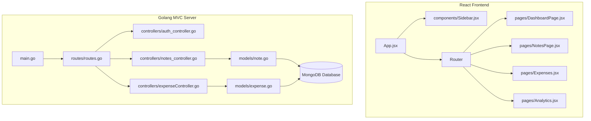

# Noted. — Note & Expense Workspace

A state-of-the-art, secure, and visually stunning web workspace built with **Golang (Gin)**, **React 18 (Vite + Tailwind CSS v4)**, and **MongoDB**. *Noted.* combines premium note-taking controls with a robust expense ledger and intelligent analytics to serve as your ultimate productivity and personal finance cockpit.

---

## ✨ Key Features

### 📝 Notes Cockpit
* **Workspace Metrics Dashboard:** Track total documents, pinned note counts, active topics, and total word count across your entire workspace.
* **Colored Canvas Customization:** Choose from slate, indigo, emerald, amber, and rose card themes that dynamically adapt to active light/dark environments.
* **Pin & Pinning Queues:** Elevate important thoughts, checklists, or reminders to the top of your workspace instantly.
* **Fast Actions:**
  * **Copy to Clipboard:** Copy formatted note text with one click.
  * **Text File Downloader:** Download individual notes as clean `.txt` files with automated category headers.

### 💸 Financial Ledger
* **Aggregated Summaries:** Track lifetime expenditures, current month trends, and budget goals with a clean, dynamic progress meter.
* **Custom Budget Configurations:** Set and edit your monthly spending thresholds on the fly.
* **Advanced Ledger Controls:** Robust title, category, and date search inputs.
* **Dynamic Date Range Filters:** Isolate transactions between any two dates instantly.
* **Spreadsheet Exporter:** Single-click CSV ledger export, packing fully formatted columns (`Title`, `Amount`, `Category`, `Description`, `Date`, `Created At`) into spreadsheet-ready documents.

### 📊 Financial Analytics & Personal Coach
* **Interactive Data Visualizations:** Beautiful allocations donut charts and monthly spending trend lines.
* **Smart Financial Advisory:** An intelligent, real-time budgeting card that monitors spending thresholds, gives alert warnings, and provides customized personal coaching based on your highest expenditure categories.

### 🎨 Premium Dynamic Design System
* **Curated Harmonious Themes:** Toggle between premium Light Modern, Dark Indigo, Dark Emerald, and Dark Rose modes on the fly.
* **Micro-Animations & Visuals:** Sleek hover-effects, glassmorphism layers, and floating animated gradient blobs built to wow at first glance.

---

## 🛠️ Technology Stack

### Backend
* **Language:** Go (Golang)
* **Web Framework:** Gin Gonic HTTP Engine
* **Database Driver:** Official MongoDB Go Driver
* **Authentication:** Stateless JSON Web Tokens (JWT)
* **Password Encryption:** bcrypt

### Frontend
* **Core:** React 18 (Vite Toolchain)
* **Styling:** Tailwind CSS v4 + Vanilla HSL-variable tokens
* **Icons:** Lucide React
* **Charts:** Recharts (responsive HTML5 Canvas/SVG renderers)
* **API Client:** Axios (intercepted authorization header context)

---

## 🚀 Getting Started

### Prerequisites
1. **Node.js** (v16+)
2. **Go** (v1.18+)
3. **MongoDB** listening locally on port `27017`

### 1. Backend Setup
1. Open your terminal and navigate to the backend folder:
   ```bash
   cd backend
   ```
2. Build or run the Golang application:
   ```bash
   go run main.go
   ```
   *Alternatively, execute the pre-compiled binary:*
   ```bash
   .\main.exe
   ```
3. The server will start listening on port `8081` and connect to MongoDB.

### 2. Frontend Setup
1. Open another terminal and navigate to the frontend folder:
   ```bash
   cd frontend
   ```
2. Install npm dependencies:
   ```bash
   npm install
   ```
3. Boot up the Vite developer server:
   ```bash
   npm run dev
   ```
4. Click the local URL (usually `http://localhost:5173/`) to access the web application!

---

## 📂 Project Architecture



---

## 📄 License
This project is licensed under the MIT License. Developed for supreme productivity and wealth mastery.
