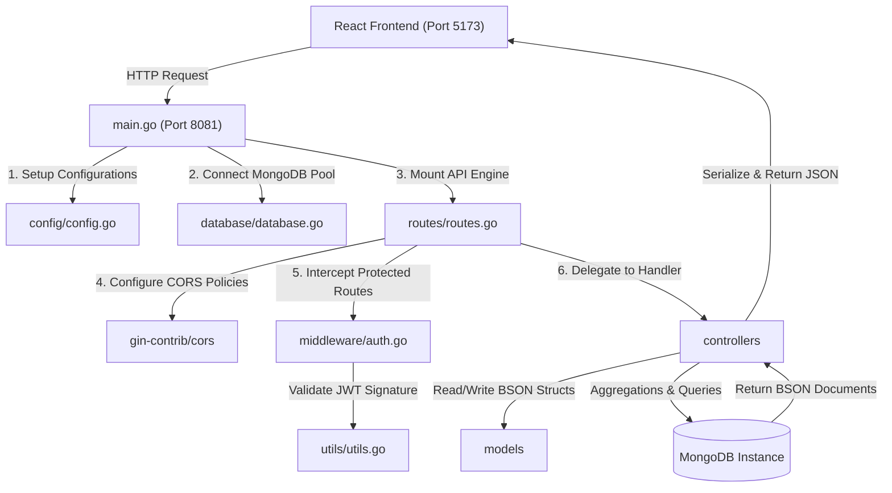

# 🚀 "Noted." Backend Architecture & Line-by-Line Code Manual

Welcome to the ultimate, exhaustive developer reference manual for the **Noted.** backend. This guide serves as a comprehensive master class, walking through every single package, module, function, and **line of code** in the codebase. 

This backend is designed with high-performance, industry-standard **Go (Golang)**, the high-throughput **Gin Gonic** HTTP framework, and **MongoDB** for flexible document indexing. 

---

## 🗺️ Architectural Topology & Request Lifecycle

Before diving into the code, here is how control flows through the backend. The architecture is a decoupled, MVC-like structure (excluding views, since this is a pure JSON API) that ensures clean separation of concerns:



---

## 📁 1. Core Bootstrapper: `main.go`

`main.go` acts as the entry point of the entire application. It coordinates configuration parsing, database initialization, routing setups, and spawns the network-blocking HTTP server loop.

### Complete Annotated Code
```go
package main

import (
	"log"

	"backend/config"
	"backend/database"
	"backend/routes"
)

func main() {
	log.Println("Initializing Noted. Golang API Server...")

	// 1. Load Configuration parameters
	cfg := config.LoadConfig()

	// 2. Establish connection pool to MongoDB
	database.ConnectDB(cfg)

	// 3. Spin up Gin HTTP Engine with CORS and Route handlers
	r := routes.SetupRouter(cfg)

	// 4. Start listening on the specified network address
	log.Printf("Noted. API Server successfully listening on port %s", cfg.Port)
	if err := r.Run(":" + cfg.Port); err != nil {
		log.Fatalf("Server startup failed: %v", err)
	}
}
```

### Line-by-Line Breakdown

| Line No. | Code Snippet | How it Works under the Hood | Why We Need It |
| :--- | :--- | :--- | :--- |
| **1** | `package main` | Declares this file as part of the `main` package. | In Go, the `main` package tells the compiler to compile this codebase as an executable binary instead of a utility package. |
| **3-9** | `import ( ... )` | Resolves external packages and standard libraries (`log`) as well as internal path declarations relative to the module name defined in `go.mod`. | Imports external components so they can be executed within this file. Imports are verified and downloaded into `go.sum` during build. |
| **11** | `func main() {` | Defines the central entrypoint function `main()`. | When the operating system runs the compiled binary, execution begins precisely on the first line of this function. |
| **12** | `log.Println(...)` | Writes a standard string message to Go's console stream. | Provides immediate developer feedback on server launch, prepended automatically with standard system timestamps. |
| **15** | `cfg := config.LoadConfig()` | Calls configuration parser from `config` package, returning an active, validated `Config` pointer struct. | Loads ports, secret keys, and database connection strings before spin-up. If this fails, no subsequent component can run. |
| **18** | `database.ConnectDB(cfg)` | Feeds configuration pointer to database connection utility to initialize the client pool. | Connects to MongoDB, sets up collection handles, and verifies network roundtrips. Establishes stateful MongoDB sessions. |
| **21** | `r := routes.SetupRouter(cfg)` | Calls route initializer to register middleware, route groupings, CORS rules, and handlers. | Configures our HTTP routing registry, defining which handler maps to which URL path. Returns a customized `*gin.Engine`. |
| **24** | `log.Printf(...)` | Prints formatted terminal logs detailing active port. | Keeps operators informed of the running port (helpful during environment switches). |
| **25-27** | `if err := r.Run(":" + cfg.Port); err != nil { log.Fatalf(...) }` | Invokes Gin's TCP listening block. If the port is locked, it logs the error and triggers system exit code `1`. | Blocks the main execution thread, maintaining a persistent network listener loop to receive and route incoming API calls. |

---

## 📁 2. Configuration & Environment Manager: `config/config.go`

This file parses local configuration settings. It dynamically scans local directories for a `.env` file, extracts environment values, and handles fallback logic if environment parameters are missing.

### Complete Annotated Code
```go
package config

import (
	"bufio"
	"log"
	"os"
	"path/filepath"
	"strings"
)

type Config struct {
	MongoURI      string
	JWTSecret     string
	Port          string
	AllowedOrigin string
}

// LoadEnv loads environment variables from a .env file if it exists
func LoadEnv() {
	// Try loading from .env, backend/.env, or parent folder
	paths := []string{".env", "../.env", "backend/.env"}
	var loaded bool

	for _, path := range paths {
		absPath, err := filepath.Abs(path)
		if err != nil {
			continue
		}

		file, err := os.Open(absPath)
		if err != nil {
			continue
		}
		defer file.Close()

		scanner := bufio.NewScanner(file)
		for scanner.Scan() {
			line := strings.TrimSpace(scanner.Text())
			// Ignore empty lines and comments
			if line == "" || strings.HasPrefix(line, "#") {
				continue
			}
			parts := strings.SplitN(line, "=", 2)
			if len(parts) != 2 {
				continue
			}
			key := strings.TrimSpace(parts[0])
			val := strings.TrimSpace(parts[1])

			// Strip quotes if they surround the value
			if (strings.HasPrefix(val, "\"") && strings.HasSuffix(val, "\"")) ||
				(strings.HasPrefix(val, "'") && strings.HasSuffix(val, "'")) {
				val = val[1 : len(val)-1]
			}

			// Set env variable
			os.Setenv(key, val)
		}
		log.Printf("Loaded environment configurations from: %s", absPath)
		loaded = true
		break // Only load the first found file
	}

	if !loaded {
		log.Println("No local .env file found. Utilizing system environment variables and developer fallbacks.")
	}
}

// LoadConfig loads environment configurations with standard developer fallbacks
func LoadConfig() *Config {
	// Dynamically parse local .env file
	LoadEnv()

	mongoURI := os.Getenv("MONGO_URI")
	if mongoURI == "" {
		// Standard MongoDB local fallback
		mongoURI = "mongodb://localhost:27017"
	}

	jwtSecret := os.Getenv("JWT_SECRET")
	if jwtSecret == "" {
		jwtSecret = "super_secret_notes_jwt_key_that_is_long_and_secure"
	}

	port := os.Getenv("PORT")
	if port == "" {
		port = "8081"
	}

	allowedOrigin := os.Getenv("ALLOWED_ORIGIN")
	if allowedOrigin == "" {
		allowedOrigin = "http://localhost:5173"
	}

	return &Config{
		MongoURI:      mongoURI,
		JWTSecret:     jwtSecret,
		Port:          port,
		AllowedOrigin: allowedOrigin,
	}
}
```

### Line-by-Line Breakdown

- **`type Config struct { ... }` (Lines 11-16)**
  - Defines a struct mapping out all configurations the backend needs. This isolates configuration loading from implementation detail.
- **`func LoadEnv() { ... }` (Lines 19-67)**
  - **`paths := []string{".env", "../.env", "backend/.env"}`**: Establishes directory fallback paths to scan for a `.env` file, supporting different execution directories.
  - **`absPath, err := filepath.Abs(path)`**: Resolves relative file paths to dynamic absolute paths on the operating system filesystem.
  - **`file, err := os.Open(absPath)`**: Opens the file at the target path in read-only mode.
  - **`defer file.Close()`**: Registers a cleanup call to close the open file handle as soon as `LoadEnv` terminates, avoiding memory leaks.
  - **`scanner := bufio.NewScanner(file)`**: Instantiates an efficient buffered line scanner to parse the file line by line.
  - **`line := strings.TrimSpace(scanner.Text())`**: Trims outer whitespace characters (`\n`, `\r`, `\t`, ` `) from each line.
  - **`if line == "" || strings.HasPrefix(line, "#") { continue }`**: Skips empty lines and comments (lines starting with `#`).
  - **`parts := strings.SplitN(line, "=", 2)`**: Splits the line into exactly two strings using the first `=` delimiter.
  - **`key := strings.TrimSpace(parts[0])`** and **`val := strings.TrimSpace(parts[1])`**: Trims spacing around keys and values.
  - **`if (strings.HasPrefix(val, "\"") && ...)`**: Checks for enclosing quotes (`"` or `'`) around the value and strips them to prevent parsing quotes as part of the configuration.
  - **`os.Setenv(key, val)`**: Injects the variable directly into the current running operating system process space.
  - **`loaded = true; break`**: Flags a successful load and terminates the search loop to avoid overwriting variables with other `.env` files.
- **`func LoadConfig() *Config { ... }` (Lines 70-101)**
  - **`LoadEnv()`**: Triggers the `.env` scanner.
  - **`os.Getenv("...")`**: Queries variables from system environment variables.
  - **Fallback Blocks (`if ... == "" { ... }`)**: If variables are blank, we inject developer-friendly default values (Port: `8081`, DB: local Mongo, secret key, React client origin `http://localhost:5173`). This makes launching the application in a local environment completely zero-friction.

---

## 📁 3. Database Lifecycle Module: `database/database.go`

`database.go` is the data persistence anchor. It manages stateful connection pools to MongoDB and exposes handles to database collections globally.

### Complete Annotated Code
```go
package database

import (
	"context"
	"log"
	"time"

	"backend/config"

	"go.mongodb.org/mongo-driver/mongo"
	"go.mongodb.org/mongo-driver/mongo/options"
)

var (
	Client             *mongo.Client
	DB                 *mongo.Database
	UserCollection     *mongo.Collection
	NotesCollection    *mongo.Collection
	ExpensesCollection *mongo.Collection
)

// ConnectDB establishes connection to MongoDB and sets up collections
func ConnectDB(cfg *config.Config) {
	ctx, cancel := context.WithTimeout(context.Background(), 10*time.Second)
	defer cancel()

	clientOptions := options.Client().ApplyURI(cfg.MongoURI)
	client, err := mongo.Connect(ctx, clientOptions)
	if err != nil {
		log.Fatalf("MongoDB connection error: %v", err)
	}

	// Ping database to verify connection is alive
	err = client.Ping(ctx, nil)
	if err != nil {
		log.Fatalf("MongoDB ping failed: %v", err)
	}

	log.Println("Successfully connected to MongoDB!")

	Client = client
	DB = client.Database("notes_app_db")
	UserCollection = DB.Collection("users")
	NotesCollection = DB.Collection("notes")
	ExpensesCollection = DB.Collection("expenses")
}
```

### Line-by-Line Breakdown

- **`var ( Client *mongo.Client ... )` (Lines 14-20)**
  - Declares globally accessible pointers for the Mongo Client, Database structure, and three collections (`users`, `notes`, `expenses`).
  - > [!NOTE]
    > While dependency injection is a valid design pattern, declaring global thread-safe variables is an idiomatic Go pattern for microservices. The MongoDB driver's internal connection pool is naturally thread-safe.
- **`ctx, cancel := context.WithTimeout(...)` (Line 24)**
  - Generates an operation context bound to a `10-second` limit, preventing the bootstrapper from hanging indefinitely if the database server is offline.
- **`defer cancel()` (Line 25)**
  - Ensures context execution resources are cleaned up immediately when `ConnectDB` returns.
- **`clientOptions := options.Client().ApplyURI(...)` (Line 27)**
  - Constructs configuration options for the driver, parsing the connection URI (which includes hosts, ports, and credentials).
- **`client, err := mongo.Connect(ctx, clientOptions)` (Line 28)**
  - Spawns the MongoDB connection manager. If a syntactic URI error is detected, `err` is returned.
- **`err = client.Ping(ctx, nil)` (Line 34)**
  - Actively sends an administrative ICMP-like ping to the MongoDB host to confirm that TCP handshakes, authentication, and network routes are working.
- **`Client = client ...` (Lines 41-45)**
  - Binds established active connection objects to globally exported handles.
  - Generates the database wrapper `"notes_app_db"` and hooks collections `"users"`, `"notes"`, and `"expenses"`.

---

## 📁 4. Data Models & Schemas: `models/`

The models package defines our data structures. Go structs are marked with custom serialization tags (`bson` for MongoDB interactions and `json` for REST client communication).

### Struct tags explained:
* `bson:"_id,omitempty"`: Instructs MongoDB to map the field to the default record key `_id`. The `omitempty` flag prevents Go from overwriting populated database keys with zero-values during insertion.
* `json:"password,omitempty"`: Ensures that sensitive hashes are omitted entirely when serializing structural responses back to the frontend.
* `binding:"required,email"`: Instructs Gin's internal validation engine to reject incoming requests early with a `400 Bad Request` if the field is missing or formatted incorrectly.

---

### 📄 `models/models.go` (Users & Notes)
```go
package models

import (
	"time"

	"go.mongodb.org/mongo-driver/bson/primitive"
)

// User represents the MongoDB schema for a registered user
type User struct {
	ID       primitive.ObjectID `bson:"_id,omitempty" json:"id,omitempty"`
	Name     string             `bson:"name" json:"name" binding:"required"`
	Email    string             `bson:"email" json:"email" binding:"required,email"`
	Password string             `bson:"password" json:"password,omitempty" binding:"required,min=6"`
}

// Note represents the MongoDB schema for a user note
type Note struct {
	ID        primitive.ObjectID `bson:"_id,omitempty" json:"id,omitempty"`
	Title     string             `bson:"title" json:"title" binding:"required"`
	Content   string             `bson:"content" json:"content" binding:"required"`
	UserID    primitive.ObjectID `bson:"userId" json:"userId"`
	Pinned    bool               `bson:"pinned" json:"pinned"`
	Category  string             `bson:"category" json:"category"`
	Color     string             `bson:"color" json:"color"`
	CreatedAt time.Time          `bson:"createdAt" json:"createdAt"`
}
```

### 📄 `models/expenseModel.go` (Expenses Tracker)
```go
package models

import (
	"time"

	"go.mongodb.org/mongo-driver/bson/primitive"
)

// Expense represents the MongoDB schema for a user expense record
type Expense struct {
	ID          primitive.ObjectID `bson:"_id,omitempty" json:"id,omitempty"`
	Title       string             `bson:"title" json:"title" binding:"required"`
	Amount      float64            `bson:"amount" json:"amount" binding:"required,gt=0"`
	Category    string             `bson:"category" json:"category" binding:"required"`
	Description string             `bson:"description" json:"description"`
	Date        string             `bson:"date" json:"date" binding:"required"` // Format: YYYY-MM-DD
	UserID      primitive.ObjectID `bson:"userId" json:"userId"`
	CreatedAt   time.Time          `bson:"createdAt" json:"createdAt"`
}
```

- **`primitive.ObjectID`**: Maps to MongoDB's unique 12-byte binary identifier (`_id`), which contains a timestamp, machine identifier, process ID, and local counter to guarantee global uniqueness.
- **`Amount float64 ... binding:"required,gt=0"`**: Double-precision floating point for financial calculations. Uses validation checks to reject empty or zero-value amounts.

---

## 📁 5. Cryptographic & Security Utilities: `utils/utils.go`

Handles password safety and session token management. This module utilizes **Bcrypt** for hashing passwords and **JWT** (JSON Web Tokens) to authenticate requests statelessly.

### Complete Annotated Code
```go
package utils

import (
	"errors"
	"time"

	"github.com/golang-jwt/jwt/v5"
	"golang.org/x/crypto/bcrypt"
)

// HashPassword hashes a plain text password using bcrypt
func HashPassword(password string) (string, error) {
	bytes, err := bcrypt.GenerateFromPassword([]byte(password), 12)
	return string(bytes), err
}

// CheckPasswordHash compares a plain password with a bcrypt hash
func CheckPasswordHash(password, hash string) bool {
	err := bcrypt.CompareHashAndPassword([]byte(hash), []byte(password))
	return err == nil
}

// Claims defines the JWT claims structure containing user ID
type Claims struct {
	UserID string `json:"userId"`
	jwt.RegisteredClaims
}

// GenerateToken creates a signed JWT token containing the userId, valid for 24 hours
func GenerateToken(userID string, jwtSecret string) (string, error) {
	expirationTime := time.Now().Add(24 * time.Hour)
	claims := &Claims{
		UserID: userID,
		RegisteredClaims: jwt.RegisteredClaims{
			ExpiresAt: jwt.NewNumericDate(expirationTime),
			IssuedAt:  jwt.NewNumericDate(time.Now()),
		},
	}

	token := jwt.NewWithClaims(jwt.SigningMethodHS256, claims)
	tokenString, err := token.SignedString([]byte(jwtSecret))
	return tokenString, err
}

// ValidateToken verifies a token string and extracts the associated userId
func ValidateToken(tokenString string, jwtSecret string) (string, error) {
	claims := &Claims{}
	token, err := jwt.ParseWithClaims(tokenString, claims, func(token *jwt.Token) (interface{}, error) {
		if _, ok := token.Method.(*jwt.SigningMethodHMAC); !ok {
			return nil, errors.New("unexpected signing method")
		}
		return []byte(jwtSecret), nil
	})

	if err != nil {
		return "", err
	}

	if !token.Valid {
		return "", errors.New("invalid token")
	}

	return claims.UserID, nil
}
```

### Line-by-Line Breakdown

- **`func HashPassword(password string) ...` (Lines 11-15)**
  - **`bcrypt.GenerateFromPassword([]byte(password), 12)`**: Standard hashing algorithm. Converts plain text into a byte array and runs key-stretching iterations with a salt.
  - > [!TIP]
    > A cost parameter of `12` is highly recommended. It balances computational overhead (taking ~150-200ms per verification, which thwarts automated dictionary attacks) with server efficiency.
- **`func CheckPasswordHash(password, hash string) ...` (Lines 17-21)**
  - **`bcrypt.CompareHashAndPassword(...)`**: Extracts salt parameters from the hashed value and applies them to the incoming plain text password. It then performs a constant-time byte comparison to prevent timing attacks.
- **`type Claims struct { ... }` (Lines 24-27)**
  - Combines custom session variables (`UserID`) with standard claims (`ExpiresAt`, `IssuedAt`) defined by the JWT protocol.
- **`func GenerateToken(...)` (Lines 30-43)**
  - **`expirationTime := time.Now().Add(24 * time.Hour)`**: Configures token expiration to occur automatically after 24 hours.
  - **`jwt.NewWithClaims(jwt.SigningMethodHS256, claims)`**: Initializes a token struct specifying standard HMAC-SHA256 signature verification.
  - **`token.SignedString([]byte(jwtSecret))`**: Computes the cryptographic signature of the token using the secret key and returns the raw base64-encoded token string.
- **`func ValidateToken(...)` (Lines 46-64)**
  - **`jwt.ParseWithClaims(...)`**: Decodes the base64 token string and validates its payload against the expected claims struct.
  - **`if _, ok := token.Method.(*jwt.SigningMethodHMAC); !ok`**: A crucial security step. Verifies that the token was signed with the expected HMAC method. This prevents signature bypass attacks, where an attacker modifies the header to specify `"none"` or an asymmetric key to sign their own tokens.
  - **`return claims.UserID, nil`**: Returns the validated user ID, enabling subsequent handlers to determine who is making the request.

---

## 📁 6. HTTP Router & CORS Configurations: `routes/`

The routes layer maps HTTP requests to the appropriate controllers. It configures cross-origin security rules to allow our React client to communicate with the API.

---

### 📄 `routes/routes.go`
```go
package routes

import (
	"time"

	"backend/config"
	"backend/controllers"
	"backend/middleware"

	"github.com/gin-contrib/cors"
	"github.com/gin-gonic/gin"
)

// SetupRouter registers middleware, configures CORS policies, and binds endpoint groups
func SetupRouter(cfg *config.Config) *gin.Engine {
	r := gin.Default()

	// Configure CORS policies using standard Gin CORS contrib package
	r.Use(cors.New(cors.Config{
		AllowOrigins:     []string{cfg.AllowedOrigin},
		AllowMethods:     []string{"GET", "POST", "PUT", "PATCH", "DELETE", "OPTIONS"},
		AllowHeaders:     []string{"Origin", "Content-Type", "Accept", "Authorization"},
		ExposeHeaders:    []string{"Content-Length"},
		AllowCredentials: true,
		MaxAge:           12 * time.Hour,
	}))

	authController := controllers.NewAuthController(cfg)
	notesController := controllers.NewNotesController()
	expenseController := controllers.NewExpenseController()

	// API Endpoint Group
	api := r.Group("/api")
	{
		// Public Authentication Endpoints
		api.POST("/register", authController.Register)
		api.POST("/login", authController.Login)

		// Protected Workspace CRUD Endpoints
		protected := api.Group("/")
		protected.Use(middleware.AuthMiddleware(cfg))
		{
			protected.GET("/notes", notesController.GetNotes)
			protected.POST("/notes", notesController.CreateNote)
			protected.PUT("/notes/:id", notesController.UpdateNote)
			protected.DELETE("/notes/:id", notesController.DeleteNote)
		}

		// Register Expense Tracker Routes
		RegisterExpenseRoutes(api, cfg, expenseController)
	}

	return r
}
```

### Line-by-Line Breakdown

- **`r := gin.Default()` (Line 16)**
  - Instantiates an active engine prepended with two default middlewares: `Logger` (prints access logs to the console) and `Recovery` (recovers from unexpected runtime panics and returns a `500 Internal Server Error`, keeping the server alive).
- **`r.Use(cors.New(cors.Config{ ... }))` (Lines 19-26)**
  - Registers our Cross-Origin Resource Sharing (CORS) rules.
  - **`AllowOrigins`**: Restricts browser calls exclusively to the configured frontend address (`http://localhost:5173`).
  - **`AllowMethods` & `AllowHeaders`**: Whitelists the HTTP verbs and headers required by our REST client.
  - **`AllowCredentials: true`**: Allows frontend clients to send authentication cookies or authorization headers.
  - **`MaxAge: 12 * time.Hour`**: Instructs the browser to cache preflight OPTIONS requests for up to 12 hours, reducing network overhead.
- **`authController := ...` (Lines 28-30)**
  - Instantiates controller objects, passing configuration parameters where necessary.
- **`api := r.Group("/api")` (Line 33)**
  - Prefixes a group of routes with `/api`, keeping the API endpoints distinct from any potential static file hosting.
- **`api.POST("/register", ...)` (Lines 36-37)**
  - Binds the authentication endpoints to public routes. Anyone can access these to log in or create an account.
- **`protected := api.Group("/")` & `protected.Use(middleware.AuthMiddleware(cfg))` (Lines 40-41)**
  - Creates a nested router group protected by our token validation middleware. Any request routed here must pass token validation before proceeding to the controller.
- **`protected.GET("/notes", notesController.GetNotes) ...` (Lines 43-46)**
  - Maps REST endpoints to their respective CRUD handler operations in `notesController`.
- **`RegisterExpenseRoutes(...)` (Line 50)**
  - Delegates expense-specific routing setup to `expenseRoutes.go` to keep the router configurations modular and clean.

---

### 📄 `routes/expenseRoutes.go`
```go
package routes

import (
	"backend/config"
	"backend/controllers"
	"backend/middleware"

	"github.com/gin-gonic/gin"
)

// RegisterExpenseRoutes defines endpoints for expenses management
func RegisterExpenseRoutes(api *gin.RouterGroup, cfg *config.Config, ec *controllers.ExpenseController) {
	protected := api.Group("/")
	protected.Use(middleware.AuthMiddleware(cfg))
	{
		protected.GET("/expenses", ec.GetExpenses)
		protected.POST("/expenses", ec.CreateExpense)
		protected.PUT("/expenses/:id", ec.UpdateExpense)
		protected.DELETE("/expenses/:id", ec.DeleteExpense)
		
		// Analytics & Summaries
		protected.GET("/expenses/summary", ec.GetExpenseSummary)
		protected.GET("/expenses/category-summary", ec.GetCategorySummary)
	}
}
```

- Registers expense management routes under the same token authentication middleware.
- Mounts custom analytical endpoints (`/expenses/summary` and `/expenses/category-summary`) alongside standard CRUD operations.

---

## 📁 7. Authentication Interception Middleware: `middleware/auth.go`

This middleware intercepts incoming requests to protected routes. It validates the request's token and extracts the user's ID before allowing the request to proceed.

### Complete Annotated Code
```go
package middleware

import (
	"net/http"
	"strings"

	"backend/config"
	"backend/utils"

	"github.com/gin-gonic/gin"
)

// AuthMiddleware intercepts requests, validates the Bearer token, and extracts the User ID
func AuthMiddleware(cfg *config.Config) gin.HandlerFunc {
	return func(c *gin.Context) {
		authHeader := c.GetHeader("Authorization")
		if authHeader == "" {
			c.JSON(http.StatusUnauthorized, gin.H{"error": "Authorization header is required"})
			c.Abort()
			return
		}

		// Split the header to extract the actual token part
		parts := strings.SplitN(authHeader, " ", 2)
		if !(len(parts) == 2 && parts[0] == "Bearer") {
			c.JSON(http.StatusUnauthorized, gin.H{"error": "Authorization header must be in Format: Bearer <Token>"})
			c.Abort()
			return
		}

		tokenString := parts[1]
		userID, err := utils.ValidateToken(tokenString, cfg.JWTSecret)
		if err != nil {
			c.JSON(http.StatusUnauthorized, gin.H{"error": "Invalid, altered, or expired authorization token"})
			c.Abort()
			return
		}

		// Set user ID inside current context to be accessed by controllers
		c.Set("userId", userID)
		c.Next()
	}
}
```

### Line-by-Line Breakdown

- **`authHeader := c.GetHeader("Authorization")` (Line 16)**
  - Retrieves the value of the request's HTTP `Authorization` header.
- **`if authHeader == "" { ... c.Abort(); return }` (Lines 17-21)**
  - If the header is missing, responds with a `401 Unauthorized` JSON payload.
  - **`c.Abort()`**: Crucial Gin instruction. Terminates the request lifecycle immediately, preventing any queued downstream handlers from executing.
- **`parts := strings.SplitN(authHeader, " ", 2)` (Line 24)**
  - Splits the authorization string into exactly two substrings using the first space as a delimiter.
- **`if !(len(parts) == 2 && parts[0] == "Bearer") { ... }` (Lines 25-29)**
  - Validates that the request uses the standard `Bearer <token>` format.
- **`userID, err := utils.ValidateToken(...)` (Line 32)**
  - Invokes our token validation utility using the server's configured secret key.
- **`if err != nil { ... c.Abort() ... }` (Lines 33-37)**
  - If token verification fails (e.g. signature is invalid or token has expired), responds with a `401 Unauthorized` status and aborts the request.
- **`c.Set("userId", userID)` (Line 40)**
  - Saves the validated user ID to the Gin request context. This acts as a request-scoped key-value store, making the user ID safely accessible to downstream handlers.
- **`c.Next()` (Line 41)**
  - Successfully hands off control, letting the request proceed to the next handler in the routing chain.

---

## 📁 8. Access Controllers: `controllers/`

The controllers layer contains the core logic of our application. It processes request payloads, interacts with MongoDB, handles errors, and returns JSON responses to the client.

---

### 📄 `controllers/auth_controller.go` (Registration & Login)
Manages user accounts, handles password encryption, and generates user sessions.

### Complete Annotated Code
```go
package controllers

import (
	"context"
	"net/http"
	"time"

	"backend/config"
	"backend/database"
	"backend/models"
	"backend/utils"

	"github.com/gin-gonic/gin"
	"go.mongodb.org/mongo-driver/bson"
	"go.mongodb.org/mongo-driver/bson/primitive"
	"go.mongodb.org/mongo-driver/mongo"
)

type AuthController struct {
	cfg *config.Config
}

func NewAuthController(cfg *config.Config) *AuthController {
	return &AuthController{cfg: cfg}
}

type RegisterInput struct {
	Name     string `json:"name" binding:"required"`
	Email    string `json:"email" binding:"required,email"`
	Password string `json:"password" binding:"required,min=6"`
}

type LoginInput struct {
	Email    string `json:"email" binding:"required,email"`
	Password string `json:"password" binding:"required"`
}

// Register signs up a new user, hashes password, and issues JWT
func (ac *AuthController) Register(c *gin.Context) {
	var input RegisterInput
	if err := c.ShouldBindJSON(&input); err != nil {
		c.JSON(http.StatusBadRequest, gin.H{"error": err.Error()})
		return
	}

	ctx, cancel := context.WithTimeout(context.Background(), 5*time.Second)
	defer cancel()

	// Check if user already exists
	var existingUser models.User
	err := database.UserCollection.FindOne(ctx, bson.M{"email": input.Email}).Decode(&existingUser)
	if err == nil {
		c.JSON(http.StatusBadRequest, gin.H{"error": "Email address is already registered"})
		return
	} else if err != mongo.ErrNoDocuments {
		c.JSON(http.StatusInternalServerError, gin.H{"error": "Internal database error"})
		return
	}

	// Hash password using bcrypt
	hashedPassword, err := utils.HashPassword(input.Password)
	if err != nil {
		c.JSON(http.StatusInternalServerError, gin.H{"error": "Failed to secure password"})
		return
	}

	newUser := models.User{
		Name:     input.Name,
		Email:    input.Email,
		Password: hashedPassword,
	}

	// Insert user doc into database
	res, err := database.UserCollection.InsertOne(ctx, newUser)
	if err != nil {
		c.JSON(http.StatusInternalServerError, gin.H{"error": "Failed to save user account"})
		return
	}

	newUser.ID = res.InsertedID.(primitive.ObjectID)

	// Issue JWT token immediately on successful registration
	token, err := utils.GenerateToken(newUser.ID.Hex(), ac.cfg.JWTSecret)
	if err != nil {
		c.JSON(http.StatusInternalServerError, gin.H{"error": "Failed to generate authorization session"})
		return
	}

	// Omit password hash in output response
	newUser.Password = ""

	c.JSON(http.StatusCreated, gin.H{
		"message": "User registered successfully",
		"token":   token,
		"user":    newUser,
	})
}

// Login verifies login credentials and returns user and session token
func (ac *AuthController) Login(c *gin.Context) {
	var input LoginInput
	if err := c.ShouldBindJSON(&input); err != nil {
		c.JSON(http.StatusBadRequest, gin.H{"error": err.Error()})
		return
	}

	ctx, cancel := context.WithTimeout(context.Background(), 5*time.Second)
	defer cancel()

	// Find the user by email
	var user models.User
	err := database.UserCollection.FindOne(ctx, bson.M{"email": input.Email}).Decode(&user)
	if err != nil {
		c.JSON(http.StatusUnauthorized, gin.H{"error": "Invalid email address or password"})
		return
	}

	// Check if password hash matches bcrypt
	if !utils.CheckPasswordHash(input.Password, user.Password) {
		c.JSON(http.StatusUnauthorized, gin.H{"error": "Invalid email address or password"})
		return
	}

	// Generate a signed session JWT
	token, err := utils.GenerateToken(user.ID.Hex(), ac.cfg.JWTSecret)
	if err != nil {
		c.JSON(http.StatusInternalServerError, gin.H{"error": "Failed to create session token"})
		return
	}

	// Omit password hash in output response
	user.Password = ""

	c.JSON(http.StatusOK, gin.H{
		"message": "Logged in successfully",
		"token":   token,
		"user":    user,
	})
}
```

### Detailed Feature Breakdown

- **`Register` Method (Lines 39-97)**
  - **`c.ShouldBindJSON(&input)`**: Gin parses the request body and maps it to our `RegisterInput` struct, automatically validating types and required fields.
  - **`database.UserCollection.FindOne(...)`**: Queries MongoDB to check if the email is already registered. If the query returns a document, we abort registration to prevent duplicate accounts.
  - **`utils.HashPassword(...)`**: Encrypts the user's password before saving it. We **never** store passwords in plain text.
  - **`database.UserCollection.InsertOne(...)`**: Saves the new user document to MongoDB.
  - **`newUser.ID = res.InsertedID.(primitive.ObjectID)`**: Extracts the unique ID generated by MongoDB and assigns it to the user object.
  - **`utils.GenerateToken(...)`**: Generates a signed JWT session token. This logs the user in immediately upon successful registration.
  - **`newUser.Password = ""`**: Clears the password hash from the user struct to ensure it is not returned in the API response.
- **`Login` Method (Lines 100-139)**
  - **`FindOne(ctx, bson.M{"email": input.Email})`**: Retrieves the user document matching the provided email.
  - **`utils.CheckPasswordHash(input.Password, user.Password)`**: Uses Bcrypt to verify if the password matches the stored hash.
  - > [!IMPORTANT]
    > If the email is not found or the password is incorrect, the server returns a generic `"Invalid email address or password"` error. This prevents email enumeration attacks, where an attacker tests emails to see if they are registered on the system.

---

### 📄 `controllers/notes_controller.go` (Secure Notes Management)
Manages notes and enforces user-level data isolation.

### Complete Annotated Code
```go
package controllers

import (
	"context"
	"net/http"
	"time"

	"backend/database"
	"backend/models"

	"github.com/gin-gonic/gin"
	"go.mongodb.org/mongo-driver/bson"
	"go.mongodb.org/mongo-driver/bson/primitive"
	"go.mongodb.org/mongo-driver/mongo/options"
)

type NotesController struct{}

func NewNotesController() *NotesController {
	return &NotesController{}
}

// GetNotes retrieves all notes belonging exclusively to the authenticated user
func (nc *NotesController) GetNotes(c *gin.Context) {
	userIDStr, exists := c.Get("userId")
	if !exists {
		c.JSON(http.StatusUnauthorized, gin.H{"error": "Unauthorized access"})
		return
	}

	userID, err := primitive.ObjectIDFromHex(userIDStr.(string))
	if err != nil {
		c.JSON(http.StatusBadRequest, gin.H{"error": "Invalid user identity format"})
		return
	}

	ctx, cancel := context.WithTimeout(context.Background(), 5*time.Second)
	defer cancel()

	// Sort pinned notes to the top, and sort chronologically descending (latest first)
	findOptions := options.Find()
	findOptions.SetSort(bson.D{
		{Key: "pinned", Value: -1},
		{Key: "createdAt", Value: -1},
	})

	cursor, err := database.NotesCollection.Find(ctx, bson.M{"userId": userID}, findOptions)
	if err != nil {
		c.JSON(http.StatusInternalServerError, gin.H{"error": "Failed to load notes from database"})
		return
	}
	defer cursor.Close(ctx)

	notes := []models.Note{} // Ensure empty slice rather than nil for standard JSON encoding
	if err = cursor.All(ctx, &notes); err != nil {
		c.JSON(http.StatusInternalServerError, gin.H{"error": "Error reading database records"})
		return
	}

	c.JSON(http.StatusOK, notes)
}

// CreateNote saves a new note tagged with the authenticated user ID
func (nc *NotesController) CreateNote(c *gin.Context) {
	userIDStr, exists := c.Get("userId")
	if !exists {
		c.JSON(http.StatusUnauthorized, gin.H{"error": "Unauthorized access"})
		return
	}

	userID, err := primitive.ObjectIDFromHex(userIDStr.(string))
	if err != nil {
		c.JSON(http.StatusBadRequest, gin.H{"error": "Invalid user identity format"})
		return
	}

	var input models.Note
	if err := c.ShouldBindJSON(&input); err != nil {
		c.JSON(http.StatusBadRequest, gin.H{"error": err.Error()})
		return
	}

	// Tie the note to this authenticated user
	input.UserID = userID
	input.CreatedAt = time.Now()

	ctx, cancel := context.WithTimeout(context.Background(), 5*time.Second)
	defer cancel()

	res, err := database.NotesCollection.InsertOne(ctx, input)
	if err != nil {
		c.JSON(http.StatusInternalServerError, gin.H{"error": "Failed to create note record"})
		return
	}

	input.ID = res.InsertedID.(primitive.ObjectID)

	c.JSON(http.StatusCreated, input)
}

// UpdateNote modifies an existing note after verifying user ownership
func (nc *NotesController) UpdateNote(c *gin.Context) {
	userIDStr, exists := c.Get("userId")
	if !exists {
		c.JSON(http.StatusUnauthorized, gin.H{"error": "Unauthorized access"})
		return
	}

	userID, err := primitive.ObjectIDFromHex(userIDStr.(string))
	if err != nil {
		c.JSON(http.StatusBadRequest, gin.H{"error": "Invalid user identity format"})
		return
	}

	noteIDStr := c.Param("id")
	noteID, err := primitive.ObjectIDFromHex(noteIDStr)
	if err != nil {
		c.JSON(http.StatusBadRequest, gin.H{"error": "Invalid note identity format"})
		return
	}

	var input models.Note
	if err := c.ShouldBindJSON(&input); err != nil {
		c.JSON(http.StatusBadRequest, gin.H{"error": err.Error()})
		return
	}

	ctx, cancel := context.WithTimeout(context.Background(), 5*time.Second)
	defer cancel()

	// Retrieve the note first to verify ownership
	var existingNote models.Note
	err = database.NotesCollection.FindOne(ctx, bson.M{"_id": noteID}).Decode(&existingNote)
	if err != nil {
		c.JSON(http.StatusNotFound, gin.H{"error": "Note not found"})
		return
	}

	if existingNote.UserID != userID {
		c.JSON(http.StatusForbidden, gin.H{"error": "Forbidden: You are not the owner of this note"})
		return
	}

	// Construct updating query
	update := bson.M{
		"$set": bson.M{
			"title":    input.Title,
			"content":  input.Content,
			"pinned":   input.Pinned,
			"category": input.Category,
			"color":    input.Color,
		},
	}

	_, err = database.NotesCollection.UpdateOne(ctx, bson.M{"_id": noteID}, update)
	if err != nil {
		c.JSON(http.StatusInternalServerError, gin.H{"error": "Failed to update note record"})
		return
	}

	// Hydrate the return struct
	input.ID = noteID
	input.UserID = userID
	input.CreatedAt = existingNote.CreatedAt

	c.JSON(http.StatusOK, input)
}

// DeleteNote purges a note after verifying user ownership
func (nc *NotesController) DeleteNote(c *gin.Context) {
	userIDStr, exists := c.Get("userId")
	if !exists {
		c.JSON(http.StatusUnauthorized, gin.H{"error": "Unauthorized access"})
		return
	}

	userID, err := primitive.ObjectIDFromHex(userIDStr.(string))
	if err != nil {
		c.JSON(http.StatusBadRequest, gin.H{"error": "Invalid user identity format"})
		return
	}

	noteIDStr := c.Param("id")
	noteID, err := primitive.ObjectIDFromHex(noteIDStr)
	if err != nil {
		c.JSON(http.StatusBadRequest, gin.H{"error": "Invalid note identity format"})
		return
	}

	ctx, cancel := context.WithTimeout(context.Background(), 5*time.Second)
	defer cancel()

	// Verify note existence and ownership
	var existingNote models.Note
	err = database.NotesCollection.FindOne(ctx, bson.M{"_id": noteID}).Decode(&existingNote)
	if err != nil {
		c.JSON(http.StatusNotFound, gin.H{"error": "Note not found"})
		return
	}

	if existingNote.UserID != userID {
		c.JSON(http.StatusForbidden, gin.H{"error": "Forbidden: You are not the owner of this note"})
		return
	}

	// Purge note document
	_, err = database.NotesCollection.DeleteOne(ctx, bson.M{"_id": noteID})
	if err != nil {
		c.JSON(http.StatusInternalServerError, gin.H{"error": "Failed to delete note record"})
		return
	}

	c.JSON(http.StatusOK, gin.H{"message": "Note deleted successfully"})
}
```

### Detailed Feature Breakdown

- **User Validation (e.g. `c.Get("userId")`)**: Extracts the `userId` attached to the request by `AuthMiddleware`. This identifies the user making the request.
- **Sorting Logic (Lines 41-45)**:
  - Configures sorting with `SetSort(bson.D{ ... })`.
  - Pinned notes are sorted first (`pinned: -1`), followed by the newest notes (`createdAt: -1`).
- **Strict Data Isolation (Lines 132-142, 194-204)**:
  - Before updating or deleting a note, the system retrieves the note and verifies ownership: `existingNote.UserID != userID`.
  - If a mismatch is detected, the request is rejected with a `403 Forbidden` response. This prevents users from accessing or modifying other users' data.
- **Null Safety**:
  - `notes := []models.Note{}`: Explicitly initializes the slice as an empty array rather than leaving it as a `nil` pointer. This ensures the API returns a valid JSON array (`[]`) instead of a `null` value when a user has no notes.

---

### 📄 `controllers/expenseController.go` (Expenses & Aggregation Analytics)
Manages expenses and aggregates financial analytics.

### Complete Annotated Code
```go
package controllers

import (
	"context"
	"net/http"
	"time"

	"backend/database"
	"backend/models"

	"github.com/gin-gonic/gin"
	"go.mongodb.org/mongo-driver/bson"
	"go.mongodb.org/mongo-driver/bson/primitive"
	"go.mongodb.org/mongo-driver/mongo/options"
)

type ExpenseController struct{}

func NewExpenseController() *ExpenseController {
	return &ExpenseController{}
}

// GetExpenses retrieves all expenses for the authenticated user with optional filter & search
func (ec *ExpenseController) GetExpenses(c *gin.Context) {
	userIDStr, exists := c.Get("userId")
	if !exists {
		c.JSON(http.StatusUnauthorized, gin.H{"error": "Unauthorized access"})
		return
	}

	userID, err := primitive.ObjectIDFromHex(userIDStr.(string))
	if err != nil {
		c.JSON(http.StatusBadRequest, gin.H{"error": "Invalid user identity format"})
		return
	}

	categoryFilter := c.Query("category")
	searchQuery := c.Query("search")

	// Construct filter query
	filter := bson.M{"userId": userID}

	if categoryFilter != "" && categoryFilter != "All" {
		filter["category"] = categoryFilter
	}

	if searchQuery != "" {
		filter["$or"] = []bson.M{
			{"title": bson.M{"$regex": searchQuery, "$options": "i"}},
			{"description": bson.M{"$regex": searchQuery, "$options": "i"}},
		}
	}

	ctx, cancel := context.WithTimeout(context.Background(), 5*time.Second)
	defer cancel()

	// Sort chronologically descending (latest date first)
	findOptions := options.Find()
	findOptions.SetSort(bson.D{
		{Key: "date", Value: -1},
		{Key: "createdAt", Value: -1},
	})

	cursor, err := database.ExpensesCollection.Find(ctx, filter, findOptions)
	if err != nil {
		c.JSON(http.StatusInternalServerError, gin.H{"error": "Failed to load expenses from database"})
		return
	}
	defer cursor.Close(ctx)

	expenses := []models.Expense{}
	if err = cursor.All(ctx, &expenses); err != nil {
		c.JSON(http.StatusInternalServerError, gin.H{"error": "Error reading database records"})
		return
	}

	c.JSON(http.StatusOK, expenses)
}

// CreateExpense saves a new expense tagged with the authenticated user ID
func (ec *ExpenseController) CreateExpense(c *gin.Context) {
	userIDStr, exists := c.Get("userId")
	if !exists {
		c.JSON(http.StatusUnauthorized, gin.H{"error": "Unauthorized access"})
		return
	}

	userID, err := primitive.ObjectIDFromHex(userIDStr.(string))
	if err != nil {
		c.JSON(http.StatusBadRequest, gin.H{"error": "Invalid user identity format"})
		return
	}

	var input models.Expense
	if err := c.ShouldBindJSON(&input); err != nil {
		c.JSON(http.StatusBadRequest, gin.H{"error": err.Error()})
		return
	}

	input.UserID = userID
	input.CreatedAt = time.Now()

	ctx, cancel := context.WithTimeout(context.Background(), 5*time.Second)
	defer cancel()

	res, err := database.ExpensesCollection.InsertOne(ctx, input)
	if err != nil {
		c.JSON(http.StatusInternalServerError, gin.H{"error": "Failed to create expense record"})
		return
	}

	input.ID = res.InsertedID.(primitive.ObjectID)
	c.JSON(http.StatusCreated, input)
}

// UpdateExpense modifies an existing expense after verifying user ownership
func (ec *ExpenseController) UpdateExpense(c *gin.Context) {
	userIDStr, exists := c.Get("userId")
	if !exists {
		c.JSON(http.StatusUnauthorized, gin.H{"error": "Unauthorized access"})
		return
	}

	userID, err := primitive.ObjectIDFromHex(userIDStr.(string))
	if err != nil {
		c.JSON(http.StatusBadRequest, gin.H{"error": "Invalid user identity format"})
		return
	}

	expenseIDStr := c.Param("id")
	expenseID, err := primitive.ObjectIDFromHex(expenseIDStr)
	if err != nil {
		c.JSON(http.StatusBadRequest, gin.H{"error": "Invalid expense identity format"})
		return
	}

	var input models.Expense
	if err := c.ShouldBindJSON(&input); err != nil {
		c.JSON(http.StatusBadRequest, gin.H{"error": err.Error()})
		return
	}

	ctx, cancel := context.WithTimeout(context.Background(), 5*time.Second)
	defer cancel()

	// Verify existence and ownership
	var existingExpense models.Expense
	err = database.ExpensesCollection.FindOne(ctx, bson.M{"_id": expenseID}).Decode(&existingExpense)
	if err != nil {
		c.JSON(http.StatusNotFound, gin.H{"error": "Expense not found"})
		return
	}

	if existingExpense.UserID != userID {
		c.JSON(http.StatusForbidden, gin.H{"error": "Forbidden: You do not own this record"})
		return
	}

	update := bson.M{
		"$set": bson.M{
			"title":       input.Title,
			"amount":      input.Amount,
			"category":    input.Category,
			"description": input.Description,
			"date":        input.Date,
		},
	}

	_, err = database.ExpensesCollection.UpdateOne(ctx, bson.M{"_id": expenseID}, update)
	if err != nil {
		c.JSON(http.StatusInternalServerError, gin.H{"error": "Failed to update expense record"})
		return
	}

	input.ID = expenseID
	input.UserID = userID
	input.CreatedAt = existingExpense.CreatedAt

	c.JSON(http.StatusOK, input)
}

// DeleteExpense purges an expense after verifying user ownership
func (ec *ExpenseController) DeleteExpense(c *gin.Context) {
	userIDStr, exists := c.Get("userId")
	if !exists {
		c.JSON(http.StatusUnauthorized, gin.H{"error": "Unauthorized access"})
		return
	}

	userID, err := primitive.ObjectIDFromHex(userIDStr.(string))
	if err != nil {
		c.JSON(http.StatusBadRequest, gin.H{"error": "Invalid user identity format"})
		return
	}

	expenseIDStr := c.Param("id")
	expenseID, err := primitive.ObjectIDFromHex(expenseIDStr)
	if err != nil {
		c.JSON(http.StatusBadRequest, gin.H{"error": "Invalid expense identity format"})
		return
	}

	ctx, cancel := context.WithTimeout(context.Background(), 5*time.Second)
	defer cancel()

	// Verify existence and ownership
	var existingExpense models.Expense
	err = database.ExpensesCollection.FindOne(ctx, bson.M{"_id": expenseID}).Decode(&existingExpense)
	if err != nil {
		c.JSON(http.StatusNotFound, gin.H{"error": "Expense not found"})
		return
	}

	if existingExpense.UserID != userID {
		c.JSON(http.StatusForbidden, gin.H{"error": "Forbidden: You do not own this record"})
		return
	}

	_, err = database.ExpensesCollection.DeleteOne(ctx, bson.M{"_id": expenseID})
	if err != nil {
		c.JSON(http.StatusInternalServerError, gin.H{"error": "Failed to delete expense record"})
		return
	}

	c.JSON(http.StatusOK, gin.H{"message": "Expense deleted successfully"})
}

// GetExpenseSummary returns totals, monthly spending, and recent transactions
func (ec *ExpenseController) GetExpenseSummary(c *gin.Context) {
	userIDStr, exists := c.Get("userId")
	if !exists {
		c.JSON(http.StatusUnauthorized, gin.H{"error": "Unauthorized access"})
		return
	}

	userID, err := primitive.ObjectIDFromHex(userIDStr.(string))
	if err != nil {
		c.JSON(http.StatusBadRequest, gin.H{"error": "Invalid user identity format"})
		return
	}

	ctx, cancel := context.WithTimeout(context.Background(), 10*time.Second)
	defer cancel()

	// 1. Calculate Grand Total
	totalPipeline := []bson.M{
		{"$match": bson.M{"userId": userID}},
		{"$group": bson.M{"_id": nil, "total": bson.M{"$sum": "$amount"}}},
	}

	var totalResult []bson.M
	totalCursor, err := database.ExpensesCollection.Aggregate(ctx, totalPipeline)
	var grandTotal float64 = 0.0
	if err == nil {
		if err = totalCursor.All(ctx, &totalResult); err == nil && len(totalResult) > 0 {
			if val, ok := totalResult[0]["total"]; ok {
				switch v := val.(type) {
				case float64:
					grandTotal = v
				case int32:
					grandTotal = float64(v)
				case int64:
					grandTotal = float64(v)
				}
			}
		}
	}

	// 2. Calculate Current Month Spending
	currentMonthStr := time.Now().Format("2006-01") // YYYY-MM
	monthlyPipeline := []bson.M{
		{
			"$match": bson.M{
				"userId": userID,
				"date":   bson.M{"$regex": "^" + currentMonthStr},
			},
		},
		{"$group": bson.M{"_id": nil, "total": bson.M{"$sum": "$amount"}}},
	}

	var monthlyResult []bson.M
	var monthlyTotal float64 = 0.0
	monthlyCursor, err := database.ExpensesCollection.Aggregate(ctx, monthlyPipeline)
	if err == nil {
		if err = monthlyCursor.All(ctx, &monthlyResult); err == nil && len(monthlyResult) > 0 {
			if val, ok := monthlyResult[0]["total"]; ok {
				switch v := val.(type) {
				case float64:
					monthlyTotal = v
				case int32:
					monthlyTotal = float64(v)
				case int64:
					monthlyTotal = float64(v)
				}
			}
		}
	}

	// 3. Fetch Recent Transactions (last 5)
	findOptions := options.Find()
	findOptions.SetLimit(5)
	findOptions.SetSort(bson.D{
		{Key: "date", Value: -1},
		{Key: "createdAt", Value: -1},
	})

	cursor, err := database.ExpensesCollection.Find(ctx, bson.M{"userId": userID}, findOptions)
	recentTransactions := []models.Expense{}
	if err == nil {
		_ = cursor.All(ctx, &recentTransactions)
	}

	// Fetch Total Notes for unified dashboard view
	totalNotes, _ := database.NotesCollection.CountDocuments(ctx, bson.M{"userId": userID})

	c.JSON(http.StatusOK, gin.H{
		"totalExpenses":      grandTotal,
		"monthlySpending":    monthlyTotal,
		"recentTransactions": recentTransactions,
		"totalNotes":         totalNotes,
	})
}

// GetCategorySummary returns total expenditures aggregated per category
func (ec *ExpenseController) GetCategorySummary(c *gin.Context) {
	userIDStr, exists := c.Get("userId")
	if !exists {
		c.JSON(http.StatusUnauthorized, gin.H{"error": "Unauthorized access"})
		return
	}

	userID, err := primitive.ObjectIDFromHex(userIDStr.(string))
	if err != nil {
		c.JSON(http.StatusBadRequest, gin.H{"error": "Invalid user identity format"})
		return
	}

	ctx, cancel := context.WithTimeout(context.Background(), 5*time.Second)
	defer cancel()

	pipeline := []bson.M{
		{"$match": bson.M{"userId": userID}},
		{
			"$group": bson.M{
				"_id":   "$category",
				"value": bson.M{"$sum": "$amount"},
			},
		},
		{
			"$project": bson.M{
				"_id":      0,
				"name":    "$_id",
				"value":   1,
			},
		},
	}

	cursor, err := database.ExpensesCollection.Aggregate(ctx, pipeline)
	if err != nil {
		c.JSON(http.StatusInternalServerError, gin.H{"error": "Failed to compile analytical categories"})
		return
	}
	defer cursor.Close(ctx)

	results := []gin.H{}
	if err = cursor.All(ctx, &results); err != nil {
		c.JSON(http.StatusInternalServerError, gin.H{"error": "Failed to decode analytical categories"})
		return
	}

	// Supply empty array instead of null if empty
	if len(results) == 0 {
		results = []gin.H{}
	}

	c.JSON(http.StatusOK, results)
}
```

### Analytical Features & Deep Dives

#### 1. Optional Filtering and Searching (Lines 37-52)
The `GetExpenses` method dynamically constructs a filter using MongoDB query operators:
* **Category Filtering**: If a specific category filter is provided (e.g. food or entertainment), the system restricts the results: `filter["category"] = categoryFilter`.
* **Search Queries**: If a text search is executed, the controller constructs an `$or` block using a case-insensitive regular expression match (`$regex` with options `"i"`) on either the title or description:
  ```go
  filter["$or"] = []bson.M{
      {"title": bson.M{"$regex": searchQuery, "$options": "i"}},
      {"description": bson.M{"$regex": searchQuery, "$options": "i"}},
  }
  ```

#### 2. Advanced MongoDB Aggregation Pipelines (Lines 245-297, 341-356)
Aggregation pipelines process data within MongoDB before returning it to the application. This is much more efficient than fetching all records and processing them in Go.

* **Calculating Total Spending**:
  ```go
  totalPipeline := []bson.M{
      {"$match": bson.M{"userId": userID}},
      {"$group": bson.M{"_id": nil, "total": bson.M{"$sum": "$amount"}}},
  }
  ```
  1. **`$match`**: Filters the collection to only process records belonging to the authenticated user.
  2. **`$group`**: Groups the filtered records (using `_id: nil` to process all records as a single group) and calculates the sum (`$sum`) of the `amount` field.

* **Calculating Monthly Spending**:
  Uses a regular expression match (`^2026-05`) on the date field to group and sum expenses for the current month.

* **Type Assertions for Numeric Values (Lines 256-265)**:
  MongoDB and driver drivers can represent numeric amounts as `float64`, `int32`, or `int64`. The controller uses a type assertion switch to safely convert these to `float64` before returning the data.
  ```go
  switch v := val.(type) {
  case float64: grandTotal = v
  case int32:   grandTotal = float64(v)
  case int64:   grandTotal = float64(v)
  }
  ```

* **Aggregation for Charts (Lines 341-356)**:
  ```go
  pipeline := []bson.M{
      {"$match": bson.M{"userId": userID}},
      {"$group": bson.M{"_id": "$category", "value": bson.M{"$sum": "$amount"}}},
      {"$project": bson.M{"_id": 0, "name": "$_id", "value": 1}},
  }
  ```
  1. **`$match`**: Restricts the dataset to the target user.
  2. **`$group`**: Groups documents by their `category` and sums the amount for each category.
  3. **`$project`**: Restructures the response documents, renaming the group key `_id` to `name` and returning the total under the key `value`. This format (`{ "name": "Food", "value": 150.00 }`) can be rendered directly by chart components on the frontend.

---

## 🔒 Crucial Security Architecture Checklist

1. **Password Security**: Cleartext passwords are encrypted using Bcrypt with a work cost of `12` before being saved. The raw passwords are discarded immediately.
2. **Stateless Authentication**: Requests are authenticated using signed JWT tokens containing the user's ID. Tokens expire automatically after 24 hours.
3. **Preventing Alg Evasion**: The system explicitly validates the signing method during token verification to protect against signature bypass attacks.
4. **Data Isolation (Anti-Idor)**: Every read, update, and delete operation verifies that the record owner matches the authenticated user ID before proceeding.
5. **CORS Restrictions**: Whitelists only the verified frontend origin (`http://localhost:5173`) to prevent cross-origin scripting attacks.
6. **Input Validation**: Uses validator bindings (e.g. `binding:"required,email"`, `binding:"required,gt=0"`) to validate request payloads before processing.
